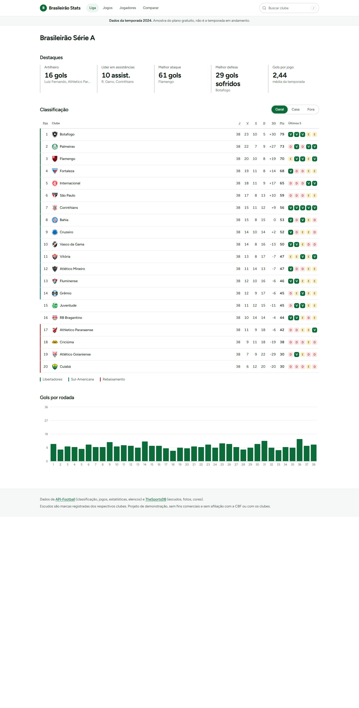
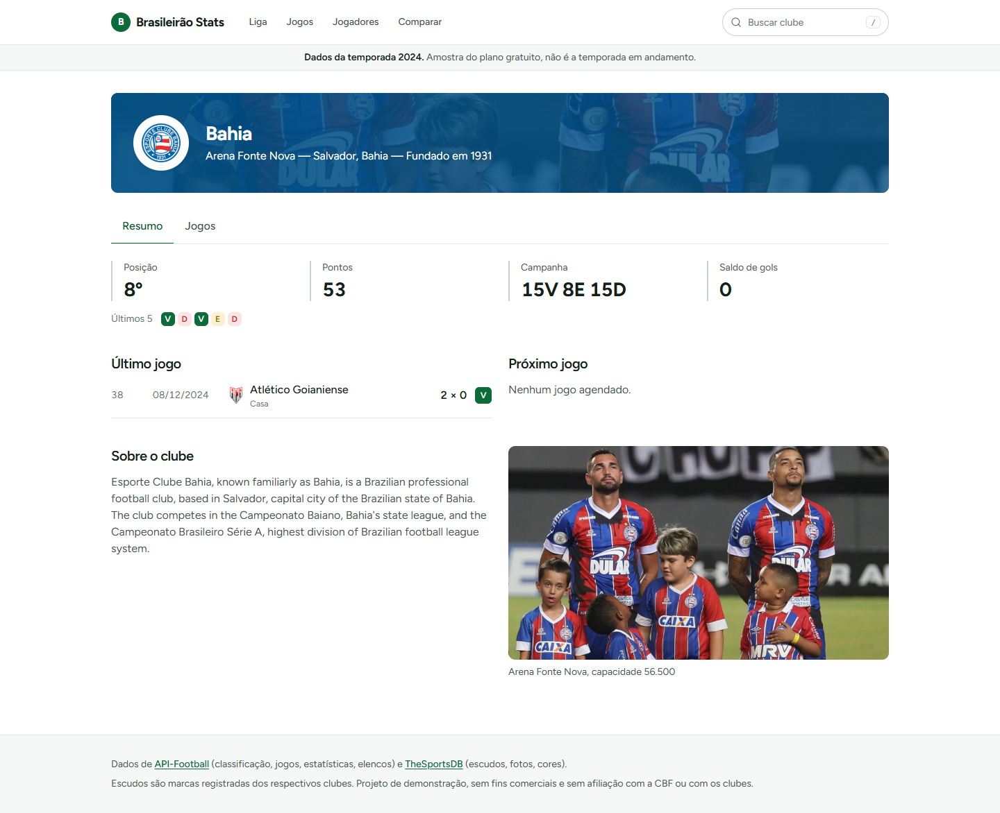
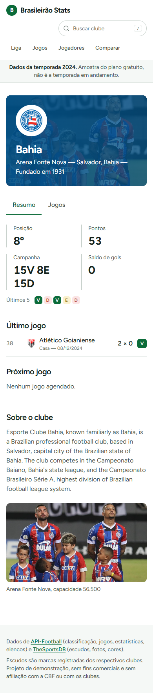
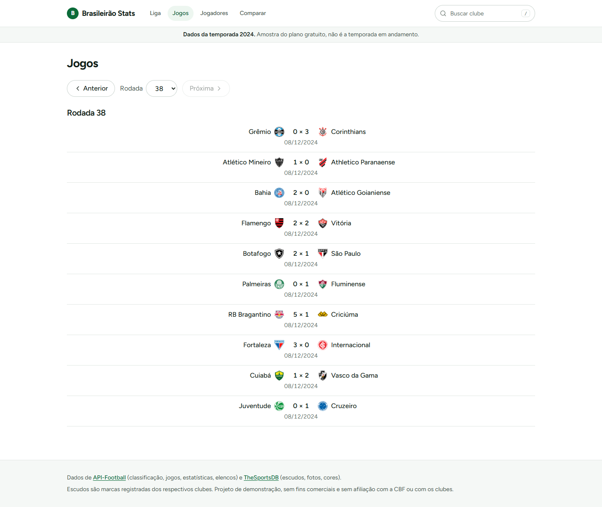
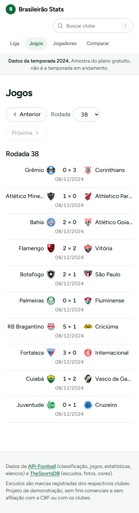
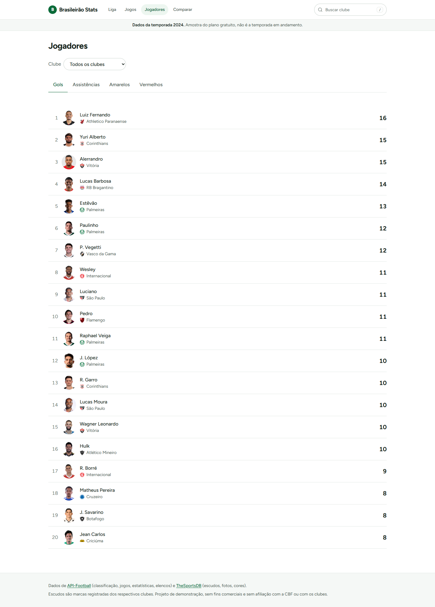
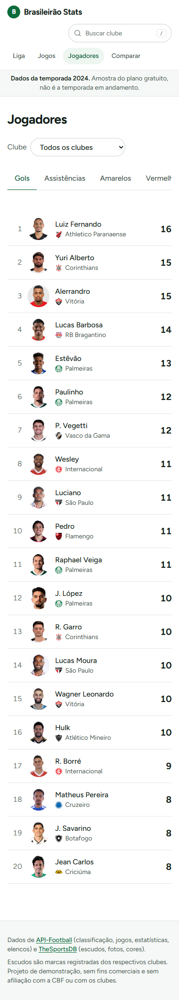
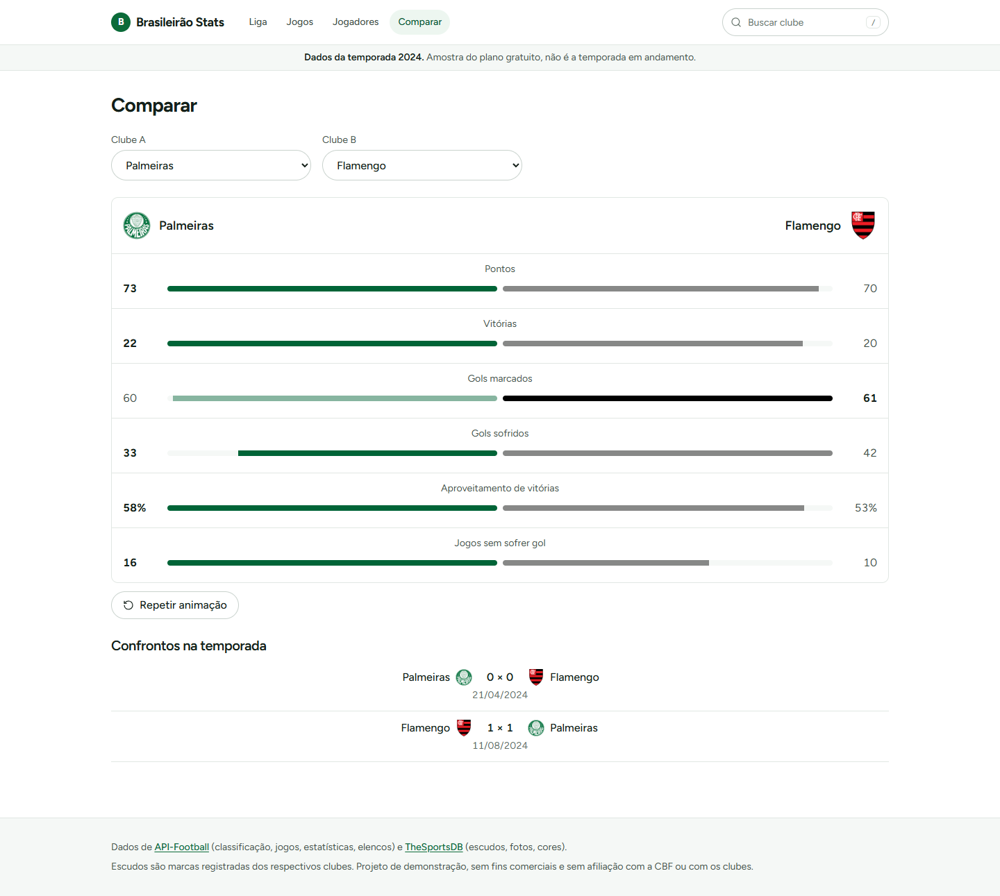
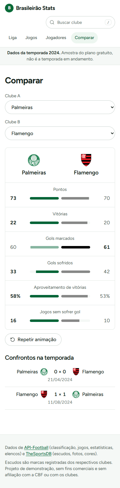

# Brasileirão Stats

Site estático de estatísticas de uma temporada da Série A do Campeonato Brasileiro: classificação, páginas de clube, jogos por rodada, rankings de jogadores e comparador de clubes.

Projeto de demonstração, sem fins comerciais, criado por **AndersonS7** para mostrar o que a IA consegue construir sob direção e julgamento humanos.



## Aviso sobre a temporada

O site mostra a **temporada 2024** (id da liga 71), a mais recente que o plano gratuito da API-Football entrega. Todas as páginas exibem esse aviso. Os dados foram coletados em 2026-09-25 (`src/data/season.json`).

## O que tem

| Página | Rota | Conteúdo |
|---|---|---|
| Classificação | `#/` | Tabela dos 20 clubes com filtro Geral/Casa/Fora, zonas, forma recente, destaques (melhor ataque, melhor defesa etc.), gols por rodada e busca de clubes (atalho `/`) |
| Clube | `#/clubes/:slug` | Cabeçalho com foto do estádio, abas Resumo, Jogos, Estatísticas (gols por faixa de minutos) e Elenco, aba na URL (`?aba=`) |
| Jogos | `#/jogos` | Seletor de rodada, anterior/próxima, rodada na URL (`?rodada=`) |
| Jogadores | `#/jogadores` | Rankings de gols, assistências, cartões amarelos e vermelhos, com filtro por clube |
| Comparar | `#/comparar` | Dois clubes lado a lado em seis métricas, barras animadas uma vez ao entrar na tela, confrontos diretos (`?a=&b=`) |

Detalhes que valem citar:

- Estados de carregamento, vazio e erro tratados (por exemplo, clube sem artilheiros mostra "Sem ranking").
- Nenhuma chamada a APIs externas em tempo de execução: JSON e imagens estão versionados no repositório.
- Estado de filtros, abas e seleções na URL, então cada tela é compartilhável.
- Responsivo de verdade: verificado em 1440px e 390px, sem scroll horizontal. Abaixo de 600px a tabela mantém posição, clube, jogos, saldo e pontos.

### Telas

| 1440px | 390px |
|---|---|
|  |  |
|  |  |
|  |  |
|  |  |

## Stack

- [Vite](https://vite.dev) + [React 19](https://react.dev) + TypeScript (strict)
- [Tailwind CSS 4](https://tailwindcss.com), tokens no `@theme` (`src/index.css`)
- React Router (rotas com hash, por causa do GitHub Pages)
- [Recharts](https://recharts.org) para os gráficos
- [Lucide](https://lucide.dev) para ícones
- Figtree (auto-hospedada via `@fontsource-variable/figtree`)
- Scripts de dados em Node com `tsx`
- Deploy: GitHub Pages via GitHub Actions (`.github/workflows/deploy.yml`)

Sem backend. Astro não foi usado: o projeto é um app interativo com várias rotas.

## Como rodar

Requisitos: Node 20+.

```bash
npm install
npm run dev        # servidor de desenvolvimento
npm run build      # tsc -b + build de produção em dist/
npm run preview    # serve o build
npm run lint
```

O site funciona sem chave de API: os dados já estão em `src/data/` e as imagens em `public/img/`.

### Atualizar os dados (opcional)

Só é necessário para recoletar a temporada.

1. Copie `.env.example` para `.env` e preencha `API_FOOTBALL_KEY` (plano gratuito, 100 requisições por dia).
2. Rode em ordem:

```bash
npm run data:collect     # busca na API-Football e no TheSportsDB (cache em scripts/.cache)
npm run data:transform   # gera os JSON de src/data e baixa as imagens
npm run data:check       # valida consistência (jogos, classificação, elencos)
```

A chave é usada só em tempo de build e nunca vai para o repositório (`.env` está no `.gitignore`).

## Estrutura

```
src/
  app/            shell, rotas, aviso da temporada, rodapé, 404
  components/ui/  Crest, FormBadges, SegmentedControl, StatTile, SearchField...
  features/       league, club, fixtures, players, compare
  lib/            cálculos puros (classificação, destaques, comparador, busca)
  data/           JSON gerados pelo pipeline
  types/          tipos dos dados
scripts/          coleta, transformação e verificação dos dados
docs/             brief, design, specs e screenshots
```

## Fontes de dados e créditos

| Fonte | Uso |
|---|---|
| [API-Football](https://www.api-football.com) (plano gratuito) | classificação, jogos, estatísticas, rankings, elencos |
| [TheSportsDB](https://www.thesportsdb.com) (chave gratuita) | escudos, fotos de estádios e jogadores, cores, descrições |

Escudos são marcas registradas dos respectivos clubes. Projeto de demonstração, sem fins comerciais e sem afiliação com a CBF ou com os clubes. O rodapé de todas as páginas repete esse aviso.

## Design

Fundo branco, texto grafite e um único verde de ação. Bordas finas e espaço em branco no lugar de sombras. A única animação é o crescimento das barras do comparador. Tokens e regras em [`docs/design.md`](docs/design.md); direção visual aprovada em [`docs/design-system.html`](docs/design-system.html).

Acessibilidade: texto com contraste mínimo de 4,5:1, foco visível, `prefers-reduced-motion` respeitado, HTML semântico, navegação por teclado nas abas e na busca, cor nunca é o único sinal (zonas da tabela têm barra e legenda, forma recente tem letra).

## Built with AI

Construído com **Claude Code** (modelos Claude) sob direção humana.

**Direção humana**
- Escolha do tema, do público e do que o projeto precisa provar (`docs/brief.md`).
- Aprovação da direção visual (`docs/design-system.html`) e das decisões de escopo, como incluir a aba de elenco e deixar estatísticas por partida fora da v1.
- Aprovação de cada spec, plano e lista de tarefas antes da implementação.
- Revisão dos resultados e decisões sobre commit e publicação.

**Gerado pela IA**
- Specs, planos e tarefas seguindo spec-driven development, uma fase por vez, em `docs/specs/` (features concluídas em `docs/specs/arquivados/`).
- Pipeline de dados, componentes, cálculos e gráficos.
- Verificação: build, `tsc`, lint e checagens no navegador com Playwright em 1440px e 390px, com os screenshots em `docs/screenshots/`.

**Limites conhecidos**
- Os dados são de 2024, não da temporada corrente.
- Estados como jogo adiado, próximo jogo agendado e "não se enfrentaram" existem no código, mas não foram exercitados com dados reais, porque os 380 jogos da temporada estão encerrados.
- Barras dos gráficos não recebem foco de teclado; há uma tabela oculta com os mesmos dados para leitores de tela.

## Licença

MIT. Copyright (c) 2026 AndersonS7. Veja [LICENSE](LICENSE).
